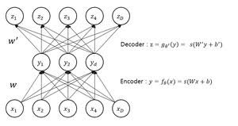

# PCA v.s. VAE

## Abstract

     This is a project that shows how PCA and Variational Auto Encoder works. I reconstructed pictures based on Olivetti Dataset with PCA and VAE. This pictures and README file will show you how do pictures look when they are reconstructed with PCA and VAE. Also this file will explain how PCA and VAE works different. So if you want information about PCA and VAE, please read this file. 

     I know I didn't made my VAE model in proper way, since it is my first ML/DL project (which was made in my first internship term). So freely write your opinion about my models.

___
## About PCA
> What is PCA?

     
     PCA(Principal Component Analysis) is a method to do dimention reduction. As you can see in the picture, PCA finds vector which is Principal Component. And PCA returns N vectors when input data has N-dimension. 

     Then which vector will be Principal Component? The answer is in the projection. We will do projection on random vector with input data, and our goal is maximizing projection's area. If we find vector which maximizes projection's area (actually, it will be distribution), then this vector will be first Principal Component. Then we will repeat this procedure but with restriction that is next Principal Component must be orthogonal prior one. This procedure will be end when we find N vectors.

     This N vectors are actually eigen vector of input data. If you want proof, you can check this site. https://excelsior-cjh.tistory.com/167
     
     With this method, we can plot N vectors in N-dimention space and get insight how to analyze input data. Or, we can keep data with lower size and features which means we may be partially be free from Curse of Dimentionality.

     
---     
### Curse of Dimentionallity

     To analyze data, we sometimes have to consider tons of features and it can be increased very easily. But we cannot gain our data easily. These problems make **data density lower**, and this situation is called Curse of Dimentionallity.

     This is why we need dimention reduction and there are two ways to reduce dimention, projection and manifold learning.
---

## About AE
> What is AE? What for?

     
     AE(Auto Encoder) is a model from unsupervised learning algorithm. It finds pattern in data without labels. Then how it computes loss? The answer is input. It uses input data to compute loss. So, this AE's output will be input data. 

     Picture shows AE's structure. In short, it has 5 layers (from bottom to top -> input layer, encoder, latent variable, decoder, output layer). We already know input layer and output layer will be same after training. Ofcourse, we ** do not use model for it's output **. This model's valuable part is latent variable.

     As you can see in this picture, encoder network will decrease input's dimension to make latent variable. And decoder network will increase latent variable's dimension. So we can interprete encoder as compressor and decoder as reconstructor. Which means decoder is trying to make output as similar as input, and encoder is trying to make latent variable that represents input well with smaller dimension.

     In other words, AE's goal is making latent variable by compressing input **well**. This **well** means subtracting negligible features in input.
     
     Now, I will explain why we need to know about AE in this project. First, AE has similar structure with VAE. Although each model has different goal, but eventually they got similar structure. Second, it is well-known that AE resembles PCA when input has linear relationship. If you what to know more about this issue, please check this post.  ** https://towardsdatascience.com/pca-vs-autoencoders-1ba08362f450 **

     

## About VAE
> What is VAE?

     TO BE CONTINUED...

---
## Difference
> PCA V.S. VAE

     TO BE CONTINUED...
---

This document was written by JYP.

